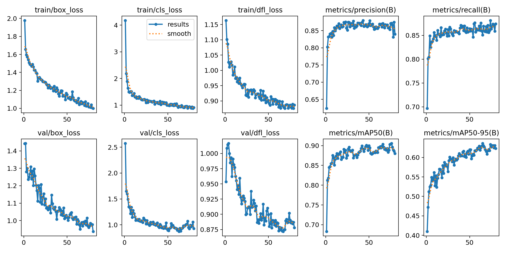

# Nine Ball ML

This repository contains a machine learning model for detecting pool balls in images and videos, specifically designed for the game of [Nine ball](https://en.wikipedia.org/wiki/Nine-ball) pool. The model is trained to recognize different colored balls and their positions on the table. This data will then be mapped to a 2D representation of the pool table, allowing for analysis and visualization of the game state.

## Features
- **Real-time Detection**: Capable of detecting pool balls in live camera feeds.
- **Video Analysis**: Process recorded videos to analyze game play.
- **Image Support**: Detect balls in static images.

## Breakdown

### 1. Data Collection
To train a custom model for pool ball detection, I first collected data by downloading YouTube videos of pool games and extracting frames to build a dataset. You can use the [`extract_frames.py`](scripts/extract_frames.py) script in the `scripts` directory to extract frames from videos. After extraction, I had 500 images to begin training. For labeling, I used [Roboflow](https://roboflow.com/) to annotate the pool balls in each image. The dataset includes a variety of ball colors and positions to help the model generalize across different scenarios. Since manually labeling thousands of images was impractical I applied data augmentation techniques—such as flipping, rotating, and adjusting brightness and contrast—to increase the dataset size and diversity.

### 2. Model Training
I trained the model using the [YOLOv11](https://github.com/ultralytics/ultralytics?tab=readme-ov-file) architecture, which is known for its efficiency and accuracy in object detection tasks. The training process involved:
- **Data Preparation**: Splitting the dataset into training and validation sets.
- **Training Configuration**: Setting hyperparameters such as learning rate, batch size, and number of epochs.
- **Training Execution**: Running the training process on a GPU for faster computation. 
- **Model Evaluation**: Evaluating the model's performance on the validation set to ensure it meets the desired accuracy.

#### 2.A Training Journal
- 07/09/2025
  - I started with 269 source images that increased to 657 after augmentation.
  - Training for 100 epochs with a batch size of 8.
  - I set the initial learning rate to 0.01 and used a patience of 15 for early stopping, which actually kicked in at epoch 80.

*Key Performance Metrics*:

| Metric                | Value              |
|-----------------------|--------------------|
| mAP@0.5               | 0.88002  (88.0%)   | 
| mAP@0.5:0.95          | 0.6232   (62.3%)   |
| Precision             | 0.83934  (83.9%)   |
| Recall                | 0.87429  (87.4%)   |



Overall, the model demonstrates strong performance in detecting pool balls, achieving high accuracy across most scenarios. However, there are some challenges that remain:

- **False Positives**: The model occasionally misclassifies the red and pink balls, likely due to their similar color profiles. To mitigate this, I plan to further refine the dataset and adjust training parameters in future iterations.
- **Missed Detections**: In frames where balls are tightly clustered or the camera angle is unusual, the model sometimes fails to detect all balls. This limitation is likely a result of the current dataset size and diversity.

Addressing these issues will involve expanding the dataset with more varied examples and experimenting with additional data augmentation techniques. Continuous evaluation and iterative improvements will help enhance the model's robustness in real-world scenarios.


### 3. Model Inference
**Video and Image Processing**: The trained model can be used to detect pool balls in both video files and images. The detection process involves:
- **Loading the Model**: The trained YOLOv11 model is loaded into memory.
- **Image Preprocessing**: Input images are resized and normalized to match the model's expected input format.
- **Inference**: The model processes the images and outputs bounding boxes, class labels, and confidence scores for detected pool balls.
- **Post-processing**: The results are filtered based on confidence scores, and the detected balls are annotated on the original images.

### 4. Visualization (In-Progress)

## Installation

1. Clone the repository:
   ```bash
   git clone https://github.com/conceptcodes/nine-ball-ml.git
   cd nine-ball-ml
   ```
2. Start the virtual environment (optional but recommended):
   ```bash
   python -m venv venv
   source venv/bin/activate  # On Windows use `venv\Scripts\activate`
   ```
3. Install the required packages:
   ```bash
   pip install -r requirements.txt
   ```

## Usage

### Detecting Balls in Images

To detect balls in a single image, use the following command:

```bash
python scripts/test.py --source path/to/image.jpg --mode image
```

### Analyzing Video Files

For video files, use:

```bash
python scripts/test.py --source path/to/video.mp4 --mode video
```

### Live Camera Feed

To start a live camera feed detection:

```bash
python scripts/test.py --mode live
```

## Contributing

Contributions are welcome! Please open an issue or submit a pull request for any improvements or bug fixes.

## License

This project is licensed under the MIT License - see the [LICENSE](LICENSE) file for details.